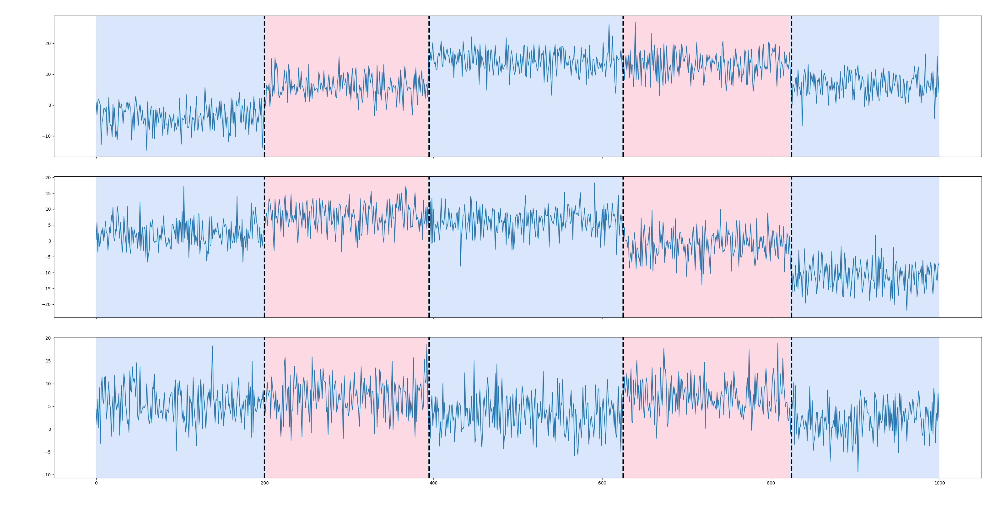

[](https://circleci.com/gh/deepcharles/ruptures)

# ruptures

`ruptures` is a Python library for off-line change point detection.
This package provides methods for the analysis and segmentation of non-stationary signals.  Implemented algorithms include exact and approximate detection for various parametric and non-parametric models.
`ruptures` focuses on ease of use by providing a well-documented and consistent interface.
In addition, thanks to its modular structure, different algorithms and models can be connected and extended within this package.

### How to cite
If you use `ruptures` in a scientific publication, we would appreciate citations to the following paper:
- C. Truong, L. Oudre, N. Vayatis. Selective review of offline change point detection methods. _Signal Processing_, 167:107299, 2020. [[journal]](https://doi.org/10.1016/j.sigpro.2019.107299) [[pdf]](http://www.laurentoudre.fr/publis/TOG-SP-19.pdf)

## Important links

- Documentation: ~[link](http://ctruong.perso.math.cnrs.fr/ruptures "Link to documentation").~ In the process of moving the documentation ([temporary link](https://deepcharles.github.io/ruptures)).
- Pypi package index: [link](https://pypi.python.org/pypi/ruptures)


# Dependencies and install

`ruptures` is tested to work under Python >= 3.4.
It is written in pure Python and depends on the following libraries: `numpy`, `scipy` and `matplotlib` (optional).

- With **pip**:
    > pip3 install ruptures

- With **conda**:
    > conda install -c conda-forge ruptures
   
- From source: download the archive and run from inside the **ruptures** directory:
    
    > python3 setup.py install
    
    or

    > python3 setup.py develop

# Basic usage

(Please refer to the [documentation](http://ctruong.perso.math.cnrs.fr/ruptures "Link to documentation") for more advanced use.)

The following snippet creates a noisy piecewise constant signal, performs a penalized kernel change point detection and displays the results (alternating colors mark true regimes and dashed lines mark estimated change points).

```python
import matplotlib.pyplot as plt
import ruptures as rpt

# generate signal
n_samples, dim, sigma = 1000, 3, 4
n_bkps = 4  # number of breakpoints
signal, bkps = rpt.pw_constant(n_samples, dim, n_bkps, noise_std=sigma)

# detection
algo = rpt.Pelt(model="rbf").fit(signal)
result = algo.predict(pen=10)

# display
rpt.display(signal, bkps, result)
plt.show()
```


# License

This project is under BSD license.

```
BSD 2-Clause License

Copyright (c) 2017, ENS Paris-Saclay, CNRS
All rights reserved.

Redistribution and use in source and binary forms, with or without
modification, are permitted provided that the following conditions are met:

* Redistributions of source code must retain the above copyright notice, this
  list of conditions and the following disclaimer.

* Redistributions in binary form must reproduce the above copyright notice,
  this list of conditions and the following disclaimer in the documentation
  and/or other materials provided with the distribution.

THIS SOFTWARE IS PROVIDED BY THE COPYRIGHT HOLDERS AND CONTRIBUTORS "AS IS"
AND ANY EXPRESS OR IMPLIED WARRANTIES, INCLUDING, BUT NOT LIMITED TO, THE
IMPLIED WARRANTIES OF MERCHANTABILITY AND FITNESS FOR A PARTICULAR PURPOSE ARE
DISCLAIMED. IN NO EVENT SHALL THE COPYRIGHT HOLDER OR CONTRIBUTORS BE LIABLE
FOR ANY DIRECT, INDIRECT, INCIDENTAL, SPECIAL, EXEMPLARY, OR CONSEQUENTIAL
DAMAGES (INCLUDING, BUT NOT LIMITED TO, PROCUREMENT OF SUBSTITUTE GOODS OR
SERVICES; LOSS OF USE, DATA, OR PROFITS; OR BUSINESS INTERRUPTION) HOWEVER
CAUSED AND ON ANY THEORY OF LIABILITY, WHETHER IN CONTRACT, STRICT LIABILITY,
OR TORT (INCLUDING NEGLIGENCE OR OTHERWISE) ARISING IN ANY WAY OUT OF THE USE
OF THIS SOFTWARE, EVEN IF ADVISED OF THE POSSIBILITY OF SUCH DAMAGE.
```
