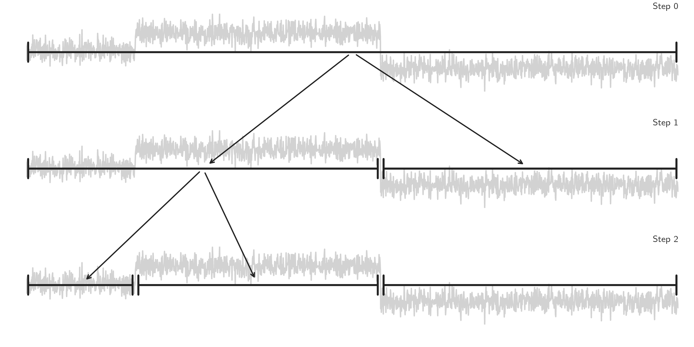

# Binary segmentation (`Binseg`)

## Description

Binary change point detection is used to perform fast signal segmentation and is implemented in [`Binseg`][ruptures.detection.binseg.Binseg].
It is a sequential approach: first, one change point is detected in the complete input signal, then series is split around this change point, then the operation is repeated on the two resulting sub-signals.
For a theoretical and algorithmic analysis of [`Binseg`][ruptures.detection.binseg.Binseg], see for instance [[Bai1997]](#Bai1997) and [[Fryzlewicz2014]](#Fryzlewicz2014).
The benefits of binary segmentation includes low complexity (of the order of $\mathcal{O}(Cn\log n)$, where $n$ is the number of samples and $C$ the complexity of calling the considered cost function on one sub-signal), the fact that it can extend any single change point detection method to detect multiple changes points and that it can work whether the number of regimes is known beforehand or not.


<center><i>Schematic view of the binary segmentation algorithm</i></center>


## Usage

Start with the usual imports and create a signal.

```python
import numpy as np
import matplotlib.pylab as plt
import ruptures as rpt
# creation of data
n = 500  # number of samples
n_bkps, sigma = 3, 5  # number of change points, noise standard deviation
signal, bkps = rpt.pw_constant(n, dim, n_bkps, noise_std=sigma)
```

To perform a binary segmentation of a signal, initialize a [`BinSeg`][ruptures.detection.binseg.Binseg] instance.

```python
# change point detection
model = "l2"  # "l1", "rbf", "linear", "normal", "ar",...
algo = rpt.Binseg(model=model).fit(signal)
my_bkps = algo.predict(n_bkps=3)

# show results
rpt.show.display(signal, bkps, my_bkps, figsize=(10, 6))
plt.show()
```
In the situation in which the number of change points is unknown, one can specify a penalty using
the `pen` parameter or a threshold on the residual norm using `epsilon`.

```python
my_bkps = algo.predict(pen=np.log(n)*dim*sigma**2)
# or
my_bkps = algo.predict(epsilon=3*n*sigma**2)
```

For faster predictions, one can modify the `jump` parameter during initialization.
The higher it is, the faster the prediction is achieved (at the expense of precision).

```python
algo = rpt.Binseg(model=model, jump=10).fit(signal)
```

## References

<a id="Bai1997">[Bai1997]</a>
Bai, J. (1997). Estimating multiple breaks one at a time. Econometric Theory, 13(3), 315–352.

<a id="Fryzlewicz2014">[Fryzlewicz2014]</a>
Fryzlewicz, P. (2014). Wild binary segmentation for multiple change-point detection. The Annals of Statistics, 42(6), 2243–2281.