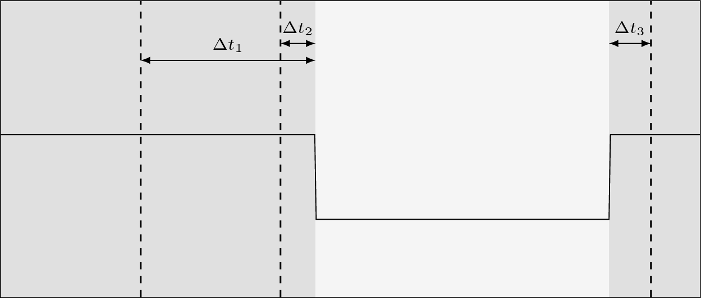

# Hausdorff metric (`hausdorff`)

## Description

The [`hausdorff`][ruptures.metrics.hausdorff.hausdorff] function computes the Hausdorff metric which measures the worst prediction error.
Assume a set of change point indexes $t_1,t_2,\dots$ and their estimates $\hat{t}_1, \hat{t}_2,\dots$.
The Hausdorff metric is then equal to

$$
\text{Hausdorff}(\{t_k\}_k, \{\hat{t}_k\}_k) :=  \max \{ \max_k \min_l |t_k - \hat{t}_l| \, , \max_k \min_l |\hat{t}_k - t_l|\}.
$$


<center><i>Schematic example: true segmentation in gray, estimated segmentation in dashed lines. Here, Hausdorff is equal to $\max(\Delta t_1, \Delta t_2, \Delta t_3)$.</i></center>

## Usage

Start with the usual imports and create two segmentations to compare.

```python
from ruptures.metrics import hausdorff
bkps1, bkps2 = [100, 200, 500], [105, 115, 350, 400, 500]
print(hausdorff(bkps1, bkps2))
```